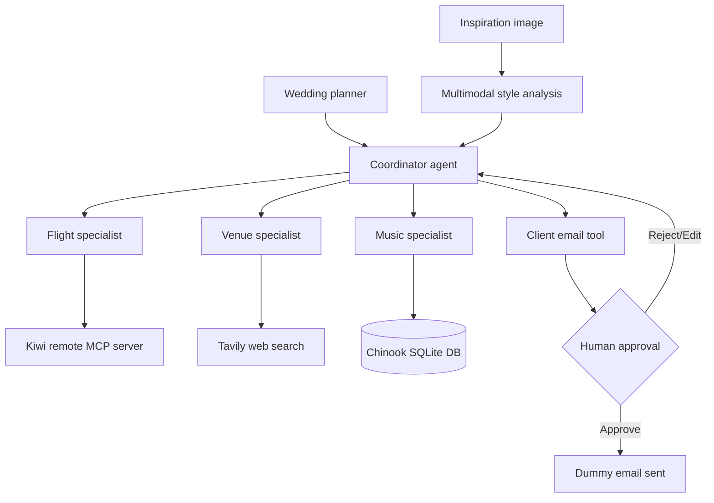

# 💍 Destination Wedding Planner Agent

LangChain project that combines a **multi-agent destination wedding planner** with a **human-approved client email workflow**.

The coordinator delegates to three specialists:

1. **Flight specialist** — connects to Kiwi's remote MCP server.
2. **Venue specialist** — searches the web using Tavily.
3. **Music specialist** — queries the Chinook SQLite database.

The coordinator stores the couple's wedding and travel details, combines the specialists' work, and drafts a client email. The email tool pauses for human approval before a dummy send occurs.

## Project story

A wedding planner is helping **Ava and Noah** organize a destination wedding in Cancun. Guests are traveling from Dallas. The planner logs in, supplies the destination, wedding date, travel dates, budget, guest count, and visual style, and asks the coordinator to create a plan.

The coordinator then:

- saves the wedding information in state;
- asks the flight agent to search Kiwi through MCP;
- asks the venue agent to research suitable venues;
- asks the music agent to query a sample music database;
- combines the results;
- drafts an email to the couple;
- pauses until the planner approves, rejects, or edits the email action.

## Architecture



## Course concept map

| Requested concept | Where it appears |
|---|---|
| Multimodal messages | `analyze_inspiration_image()` encodes an image in Base64 and sends text + image content to an agent. |
| MCP | `load_kiwi_flight_tools()` connects to the remote Kiwi MCP endpoint and loads flight tools. |
| Multi-agent wedding planner | The coordinator calls flight, venue, and music agents as tools. |
| Email agent | `send_client_email()` creates a dummy email action using the client address from context. |
| Human in the loop | `HumanInTheLoopMiddleware` interrupts only `send_client_email`. |
| Dynamic agent | Available tools, system prompt, and model change while the agent runs. |
| Node-style middleware | `trim_old_tool_messages(state, runtime)` modifies conversation state before each agent run. |
| Wrap-style middleware | `dynamic_tools`, `wedding_prompt`, and `choose_model` modify each model request. |
| Tool calls | The coordinator calls state tools, specialist-agent tools, and the email tool. |
| State | Authentication, route, dates, budget, guest count, and style change during the conversation. |
| Context | Planner credentials, client identity, and language are fixed application inputs. |
| Runtime | Node middleware receives `Runtime`; tools receive `ToolRuntime`. |
| ToolRuntime | Authentication reads context, wedding tools read/write state, and email reads the client address. |

## Files

```text
wedding_planner_agent/
├── wedding_planner.py       # Coordinator, specialists, middleware, state/context
├── demo.py                  # End-to-end command-line demo
├── data/Chinook.db          # Sample music database from the course
├── notebooks/demo.ipynb     # Guided notebook demonstration
├── PROJECT_WALKTHROUGH.md   # Beginner learning order and concept explanations
├── requirements.txt
├── .env.example
├── .gitignore
└── README.md
```

## Run locally

```bash
python -m venv .venv
source .venv/bin/activate       # Windows: .venv\Scripts\activate
pip install -r requirements.txt
cp .env.example .env
```

Add your OpenAI and Tavily keys to `.env`, then run:

```bash
python demo.py
```

## Kiwi MCP setup

The project uses this default endpoint:

```env
KIWI_MCP_URL=https://mcp.kiwi.com
```

The connection is configured with LangChain's HTTP MCP transport:

```python
kiwi_client = MultiServerMCPClient(
    {
        "kiwi_flights": {
            "url": KIWI_MCP_URL,
            "transport": "http",
        }
    }
)
```

Because a public remote service can become unavailable or change, the project has a tiny fallback tool. When Kiwi cannot connect, the rest of the application still launches, but the flight specialist clearly reports that live flight results are unavailable instead of inventing them.

## Optional multimodal test

```python
from wedding_planner import analyze_inspiration_image

summary = analyze_inspiration_image("my_wedding_inspiration.png")
print(summary)
```

Then include the returned style summary in the wedding-planning message.

## What the demo teaches

### State versus context

**State changes during the conversation:**

- authenticated status;
- departure city and destination;
- wedding and travel dates;
- budget and guest count;
- visual style summary.

**Context stays fixed for the run:**

- planner login;
- client name and email;
- preferred response language.

### ModelRequest versus Runtime versus ToolRuntime

- `ModelRequest`: changes tools, prompt, or model before an LLM call.
- `State + Runtime`: node middleware trims old tool messages.
- `ToolRuntime`: tools safely access context and update state.

### Email safety

The email tool is intentionally fake. The human-in-the-loop middleware still demonstrates the real control flow: **approve, reject, or edit before execution**.

## Good future improvements

Keep version 1 simple. Later improvements could include Gmail integration, a Streamlit UI, persistent Postgres state, guest-specific flight grouping, hotel research, and LangSmith evaluation tests.
